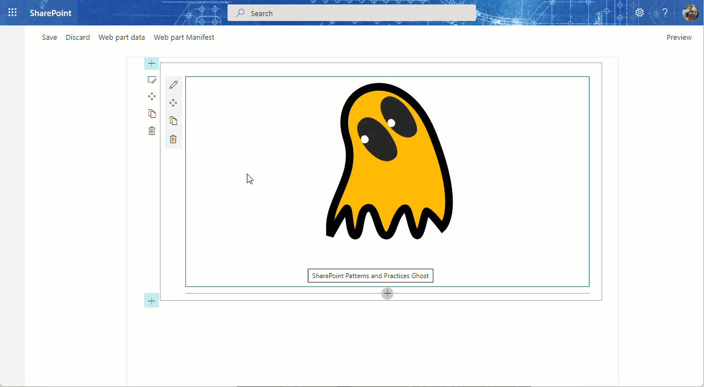

# Dynamic Scalable Vector Graphics (SVG) image using properties

## Summary

An SPFx web part that displays a Scalable Vector Graphics (SVG) image using properties to customize how it is rendered. The web part utilizes the PnP SPFx Property Controls package (specifically the SpinButton and ColorPicker) to set these properties.

## Compatibility

-Incompatible-red.svg "SharePoint Server 2016 Feature Pack 2 requires SPFx 1.1")

## Which PnP SPFx controls are being used in this sample?

* [PropertyFieldSpinButton](https://github.com/pnp/sp-dev-fx-property-controls/wiki/PropertyFieldSpinButton)
* [PropertyFieldColorPicker](https://github.com/pnp/sp-dev-fx-property-controls/wiki/PropertyFieldColorPicker)

## Applies to

* [SharePoint Framework](https://docs.microsoft.com/sharepoint/dev/spfx/sharepoint-framework-overview)
* [sp-dev-fx-property-controls](https://github.com/pnp/sp-dev-fx-property-controls)
* [PnP Ghost](https://github.com/NaderHadjebi/Ghost4)

## Solution

| Solution                     | Author(s)                                                                                                                                                                      |
| ---------------------------- | ------------------------------------------------------------------------------------------------------------------------------------------------------------------------------ |
| js-propertycontrols-svgGhost | Nader Hadjebi ([LinkedIn](https://www.linkedin.com/in/nader-hadjebi-6a677a87/), [naderhadjebi.com](https://www.naderhadjebi.com), [@nader2015](https://twitter.com/nader2015)) |

## Version history

| Version | Date               | Comments                                                                                                                               |
| ------- | ------------------ | -------------------------------------------------------------------------------------------------------------------------------------- |
| 1.0     | September 28, 2022 | Initial release                                                                                                                        |
| 1.0.1   | August 31, 2026    | Minor changes                                                                                                                          |
| 2.0     | September 6, 2026  | Upgraded to SPFx 1.23.2; migrated build toolchain from Gulp/Webpack to Heft; fixed legacy naming/config bugs from prior project rename |

## Upgrade work

The project was upgraded from SPFx 1.13 to SPFx 1.23.2.

The upgrade included:

* Migrating the build toolchain from Gulp/Webpack to Heft
* Updating the SPFx project configuration
* Updating project dependencies and package versions
* Updating the Node.js version to v22
* Fixing legacy naming and configuration issues from the previous project rename
* Updating the project to work with the SPFx 1.23.2 toolchain
* Testing and validating the upgraded web part

The complete changes can be reviewed in the repository's Git history.

## Features

Displays a Scalable Vector Graphics (SVG) image of the NH Ghost and allows users to customize the colors used and the size of the image through the use of PnP SPFx Property Controls (SpinButton & ColorPicker).

This Web Part illustrates the following concepts on top of the SharePoint Framework:

* Rendering an SVG image
* Using a PropertyFieldSpinButton control
* Using a PropertyFieldColorPicker control

## License

Copyright © 2026 Nader Hadjebi.

This project represents original work and contributions by Nader Hadjebi, including the upgrade from SPFx 1.13 to SPFx 1.23.2, migration from Gulp/Webpack to Heft, dependency updates, configuration updates, and legacy project fixes.

## Disclaimer

**THIS CODE IS PROVIDED *AS IS* WITHOUT WARRANTY OF ANY KIND, EITHER EXPRESS OR IMPLIED, INCLUDING ANY IMPLIED WARRANTIES OF FITNESS FOR A PARTICULAR PURPOSE, MERCHANTABILITY, OR NON-INFRINGEMENT.**

